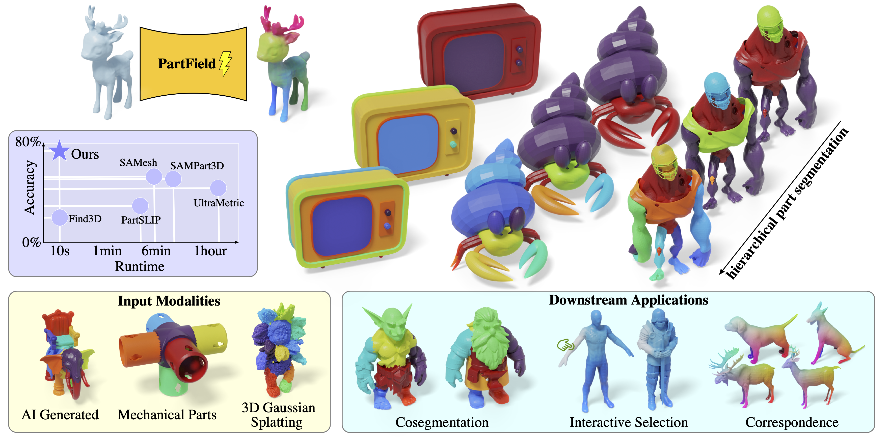

# PartField: Learning 3D Feature Fields for Part Segmentation and Beyond [ICCV 2025]
**[[Project]](https://research.nvidia.com/labs/toronto-ai/partfield-release/)** **[[PDF]](https://arxiv.org/pdf/2504.11451)**

Minghua Liu*, Mikaela Angelina Uy*, Donglai Xiang, Hao Su, Sanja Fidler, Nicholas Sharp, Jun Gao


## Overview


PartField is a feedforward model that predicts part-based feature fields for 3D shapes. Our learned features can be clustered to yield a high-quality part decomposition, outperforming the latest open-world 3D part segmentation approaches in both quality and speed. PartField can be applied to a wide variety of inputs in terms of modality, semantic class, and style. The learned feature field exhibits consistency across shapes, enabling applications such as cosegmentation, interactive selection, and correspondence.


## Environment Setup

We use Python 3.10 with PyTorch 2.4 and CUDA 12.4. The environment and required packages can be installed individually as follows:
```
conda create -n partfield python=3.10
conda activate partfield
conda install nvidia/label/cuda-12.4.0::cuda
pip install psutil
pip install torch==2.4.0 torchvision==0.19.0 torchaudio==2.4.0 --index-url https://download.pytorch.org/whl/cu124
pip install lightning==2.2 h5py yacs trimesh scikit-image loguru boto3
pip install mesh2sdf tetgen pymeshlab plyfile einops libigl polyscope potpourri3d simple_parsing arrgh open3d
pip install torch-scatter -f https://data.pyg.org/whl/torch-2.4.0+cu124.html
apt install libx11-6 libgl1 libxrender1
pip install vtk
```

An environment file is also provided and can be used for installation:
```
conda env create -f environment.yml
conda activate partfield
```

## TLDR
1. Input data (`.obj` or `.glb` for meshes, `.ply` for splats) are stored in subfolders under `data/`. You can create a new subfolder and copy your custom files into it.  
2. Extract PartField features by running the script `partfield_inference.py`, passing the arguments `result_name [FEAT_FOL]` and `dataset.data_path [DATA_PATH]`. The output features will be saved in `exp_results/partfield_features/[FEAT_FOL]`.  
3. Segmented parts can be obtained by running the script `run_part_clustering.py`, using the arguments `--root exp/[FEAT_FOL]` and `--dump_dir [PART_OUT_FOL]`. The output segmentations will be saved in `exp_results/clustering/[PART_OUT_FOL]`.  
4. Application demo scripts are available in the `applications/` directory and can be used after extracting PartField features (i.e., after running `partfield_inference.py` on the desired demo data).

## Example Run

## Pretrained Model
```
mkdir model
```
The link to download our pretrained model is here: [Trained on Objaverse](https://huggingface.co/mikaelaangel/partfield-ckpt/blob/main/model_objaverse.ckpt). Due to licensing restrictions, we are unable to release the model that was also trained on PartNet.

### Extract Feature Field 
```
python partfield_inference.py -c configs/final/demo.yaml --opts continue_ckpt model/model_objaverse.ckpt result_name partfield_features/objaverse dataset.data_path data/objaverse_samples
```


### Part Segmentation
We use agglomerative clustering for part segmentation on mesh inputs.
```
python run_part_clustering.py --root exp_results/partfield_features/objaverse --dump_dir exp_results/clustering/objaverse --source_dir data/objaverse_samples --use_agglo True --max_num_clusters 30 --option 0
```


### Split Connected Component
```
python split_connected_component.py
```
